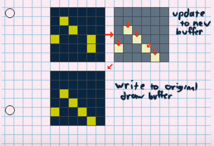
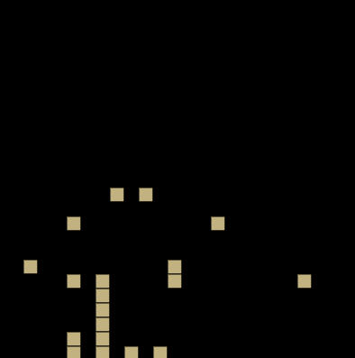
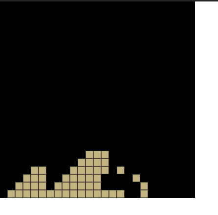

# falling sand
inspired by https://www.youtube.com/watch?v=ArcHpsTXhb0
Another Falling Sand Game

npm  i -gp5-manager

p5 server

http://localhost:5555/#/falling_sand


first working verions!!!

# first working piling behavor

# prompt
```python
write a javscript p5.js sketch.
creates two grid's
grid_current = a NxN arrays, (hiegnt, width),initalized to all 0 's
grid_buffer = a NxN arrays, (hiegnt, width), initalized to all 0's
create a enum {0: empty, 1: sand}
set current position to 
where height defaults to 10
      width  defaults to 10

create a function updateGridState to screen
inputs: 
grid_buffer, grid_current

for each row in grid

iterate the columns
if grid[current row+1][current column] is equal to enum "empty"
    set grid_buffer [current row][current column] to 'empty'
    # move the sand pixel down 
    set grid_buffer [current_rowrow+1][current column] to "sand"
if  cell bellow current is sand and grid to left & down is 'EMPTY'
    set left and down = SAND
    set current index to EMPTY


returns buffer grid

create a function draw_pixels

inputs: 
scale factor for pixels default to 4x size, grid
for each position in grid draw a rect of size scale factor by scale factor
set fill color to sandstone yellow
return 

create a function that sets the current mouse position mapped to which current grid location its pointed to and sets it from EMPTY to full
also set the surounding pixels in a radius of 5 to SAND

funciton draw()
set the result of updateGridState(scale factor, grid_buffer, grid_current) to current grid
draw_pixels
```